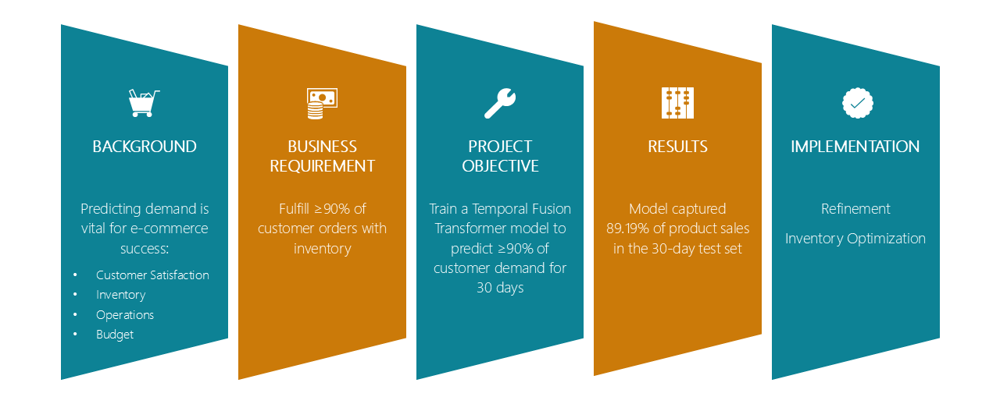
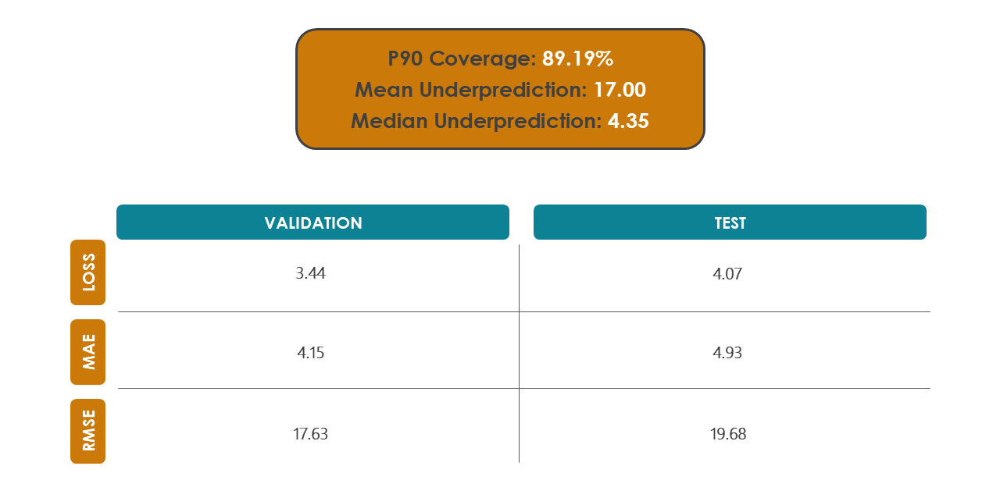
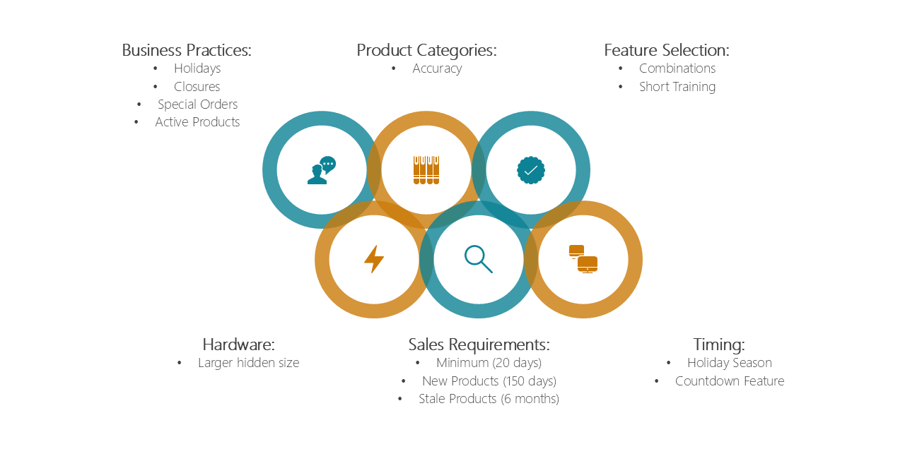
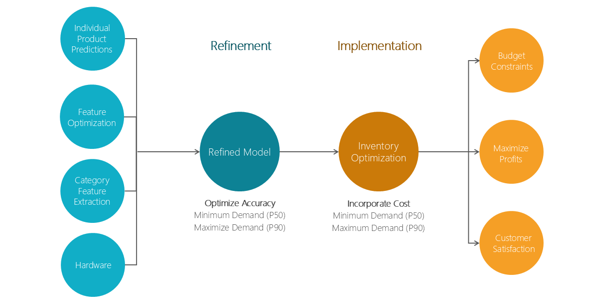

<h1>Temporal Fusion Transformer for Product Demand Forecasting</h1>
<h3>Rachael Christian - July 14, 2026</h3>

## Key Takeaways

| | Project | Business Implications |
| --- | --- | --- |
| Objective | Train TFT model to forecast 30 days of product demand | Maintain inventory to fulfill 90% of customer orders |
| Results | Model's P90 capured 89.19% of product sales in 30-day test set | Provides an accurate prediction of inventory objective |
| Recommendation | Refine model and incorporate into inventory optimization | Maximize profit while meeting budgetary, warehouse, and forecasted demand constraints |

## Introduction

A major concern for online retail businesses is balancing inventory with demand. Too much stock leads to stale inventory and higher storage costs. Too little stock results in missed sales opportunities, delays, and reduced customer satisfaction. A model that can accurately predict customer demand for products can be used for business operations, inventory management, and budget planning.

This project assumes an e-commerce business wants to maintain inventory to fulfill 90% of customer orders and is exploring options to forecast customer demand for integration into inventory optimization. This project seeks to train a Temporal Fusion Transformer (TFT) deep learning model to forecast 30 days of product demand. A TFT model was chosen for this project due to its flexibility in variable handling. Additionally, the model trains on quantiles instead of point predictions, allowing the model to incorporate distribution and risk into forecasting.

## Modeling Process

The [“Online Retail II”](data/online_retail_II.xlsx) dataset[^1] was used for this project. It contains 2 years of real transaction data from an online retailer in the United Kingdom, totaling over 1 million records. The dataset lacked critical information, such as store closures, special order thresholds, product categories, and product introduction/discontinuation. As these variables are typically available to a business and can have a stong influence on model accuracy, they were inferred through data exploration and engineered accordingly.

Data preparation included removing duplicates, returns, inventory adjustments, anomolies, and special orders as these would not impact product demand for inventory management. Uncommon products and new products were also removed. While the model could handle these, predictions would likely be inaccurate and alternative methods should be considered outside of this model.

Product categories were extracted from the product descriptions in the dataset using embeddings, Principal Component Analysis, and K-Means Clustering. Time features were engineered for the day of the week and month. Given the lack of direct business knowledge, the dataset was analyzed for trends to create flags for whether or not the business was closed, if it was a holiday, and if the product was discontinued. Price was scaled to ensure the model learned from each product's relative cost.

One of the biggest challenges of this dataset was the alignment of the validation and test sets with the holiday season. As an e-commerce business specializing in gifts and decor, the dataset showed strong seasonality with increased sales leading up to Christmas. The training set included only one full holiday season, so a countdown to Christmas created to increase model learning of the seasonal trend.

First, a learning rate finder was used to optimize the model's learning speed. A series of short runs were performed to select the variables used in the final model. The hyperparameters were then tuned, and the final model was trained and tested.

## Results

The final model was run on the test set, and the percentage of product quantity falling within the P90 quantile window was calculated. 89.19% of predictions fell below the P90 quantile threshold, falling just short of the project goal of 90%. However, given the timing challenge and the inherent variability of e-commerce sales, coverage is within reasonable error. For quantities above P90, Quantity was underpredicted by an average of 17, with a median of 4.35. Accuracy metrics showed much poorer performance on the test set than the validation set, likely due to the seasonal timing of the test set.

## Limitations

Most of the limitations of this model are due to the assumptions made and features engineered in the absence of direct knowledge of business practices. In addition to possible inaccuracies, many products were removed or flagged as discontinued that should have been retained. While features were selected through a comparison of models, the search was not exhaustive and the model may not be trained on the optimal set of features.

Hardware also limited modeling capabilities. Tests showed that model accuracy would be significantly improved with different model parameters; however, the hardware available was not able to complete training due to the increased computational requirements. Better hardware would likely increase model accuracy.

## Recommendations

While the model falls just short of the desired P90 accuracy threshold, it is accurate enough to be used in inventory management and can be refined to meet the precise business requirements. In addition to possible adjustments like feature selection and hardware upgrades, the model can be trained using quantiles targeting the inventory levels used in optimization.

For example, if inventory levels should be between 50% and 90% of the predicted demand, P50 and P90 can be used to train a model for accuracy on this specific window. If we assume the P90 forecasted demand cannot always be maintained due to warehouse capacity and budgetary constraints, the inventory can be optimized to maximize profits, incorporating space and budgetary resrictions while ensuring inventory levels remain between the desired quantile thresholds (ie 50-90% of forecasted demand).

[^1]: Chen, D. (2019, September 20). Online Retail II [Dataset]. Retrieved from UCI Machine Learning Repository: https://doi.org/10.24432/C5CG6D