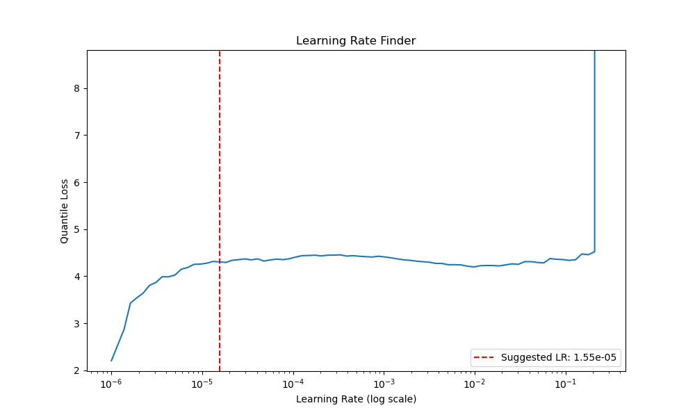

<h1>Temporal Fusion Transformer for Product Demand Forecasting</h1>
<h3>Rachael Christian - July 14, 2026</h3>

- [Introduction](#introduction)
- [Dataset](#dataset)
- [Data Cleaning](#data-cleaning)
- [Feature Extraction](#feature-extraction)
- [Feature Engineering](#feature-engineering)
- [Final Features](#final-features)
- [Modeling](#modeling)
- [Testing](#testing)
- [Analysis](#analysis)
- [Recommendations](#recommendations)

## Introduction
A major concern for online retail businesses is balancing inventory with demand. Too much stock leads to stale inventory and higher storage costs. Too little stock results in missed sales opportunities, delays, and reduced customer satisfaction. A model that can accurately predict customer demand for products can be used for business operations, including inventory optimization and budget planning.

While traditional statistical and machine learning methods have long been used by retail companies for inventory optimization, deep learning models designed for time-series forecasting have begun to offer superior accuracy[^1]. One such model is the Temporal Fusion Transformer (TFT), which combines attention-based methods with static covariates to achieve superior results [^2]. Furthermore, TFTs provide quantile predictions, allowing for the incorporation of risk into the model. Instead of providing only a single numeric prediction, the model includes windows to predict the likelihood of where future data will fall. 

Furthermore, TFTs provide quantile predictions, allowing for the incorporation of risk into the model. Instead of providing only a single numeric prediction, the model includes windows to predict the likelihood of where future data will fall. 

<h3>Objective</h3>

This project assumes a business wants to maintain inventory to fulfill 90% of customer orders, excluding special orders. It is exploring options to forecast customer demand for integration into inventory optimization. This project seeks to train a TFT model to forecast 30 days of product demand. Final model accuracy will be assessed by P90 coverage of sales within the test window.

## Dataset
The [“Online Retail II”](data/online_retail_II.xlsx) dataset[^3] was chosen for this project. It contains 2 years of real transaction data from an online retailer in the United Kingdom, totaling over 1 million records. It was downloaded from the UCI Machine Learning Repository as an Excel file and saved to a local machine.

<h3>Features</h3>

- **Invoice** – unique identifier for the transaction
- **StockCode** – unique identifier for the product
- **Description** – short description of the product
- **Quantity** – Quantity of product ordered in the transaction
- **InvoiceDate** – date and time of transaction
- **Price** – price of the product for the sales entry
- **Customer ID** – unique identifier assigned to customer
- **Country** – customer’s country

<h3>Limitations Strategies</h3>

A typical e-commerce business would have additional data available that is vital to model accuracy. Three areas were identified for feature engineering: product information, time information, and seasonality.
Most e-commerce companies maintain product categories and subcategories, which can improve model accuracy in predicting purchase patterns and potential shifts to similar products during stockouts and after discontinuation. The dataset does not provide this information, but it does include a short description. NLP and clustering techniques can be used to extract similar features.

E-commerce companies would also track the company schedule, indicating when the store was open and holidays observed. During exploration, it became clear that the business was likely closed on Saturdays and on holidays. Given that no sales can be made when the business is closed, this should be engineered to increase model accuracy.

The most difficult challenge with this dataset was the timing. As an e-commerce company specializing in gift and home décor items, the business showed strong seasonality leading up to Christmas. The dataset ended at the start of December, resulting in the validation and test sets overlapping with the Christmas surge. With only one full Christmas season in the training set, this was likely to be problematic for testing and validation. Engineering countdowns to the Christmas break may support more accurate learning for the season.

## Data Cleaning
Cleaning Files: [code](1-cleaning.py), [executed notebook](executed_notebooks/1-cleaning.html)

<h3>Duplicates</h3>

A quick review of the data in Microsoft Excel revealed overlap between the two sheets, with transactions from December 1, 2010, through December 9, 2010, present in both sheets. This was addressed by deleting all records with these dates in the “Year 2009-2010” sheet, concatenating the sheets, and saving to CSV for faster importation during EDA.

To determine how to handle the remaining duplicates, several areas were evaluated to understand the reason for their presence. First, the distribution of returns over time was compared to overall sales, and both showed consistent relative proportions. Evaluation in Data Wrangler showed that duplicates were not for entire invoices, but for individual items. Additionally, not all duplicates corresponded to returns. It was assumed that the system allowed for multiple entries of the same item on the same invoice, and that they were not errors. Therefore, duplicates were not removed.

<h3>Missing Values</h3>

The distribution of orders with missing values over time was consistent with the overall distribution of orders, indicating no anomalies. Further evaluation showed that all records with a missing value lacked a Customer ID. Filtering in Data Wrangler showed that records missing both Customer ID and Description had a cost of 0 (see screenshot in Non-Product Entries section below). The transactions were not returns as the invoice number did not begin with “C”. Additionally, their transactions did not have any other items. These factors indicated they were likely stock corrections or similar adjustments. As this factor would not affect demand forecasting, records with missing descriptions were removed. Remaining records with missing Customer IDs were retained, as they may have corresponded to guest checkouts.

<h3>Non-Product Entries</h3>

Evaluation in Data Wrangler showed many records corresponding to non-product entries, such as stock adjustments, business expenses, etc. These records did not correspond to customer demand and were removed. These include:
- lowercase Description and 0 Price (screenshot shown below)
- StockCodes in the created list
- Descriptions with keywords in the created list
- 0 price and negative quantities
- "?" descriptions
- Extreme quantity outliers that were likely errors and corrections
- Returns

<h3>Anomaly: StockCode 84016</h3>

During EDA, it was noted that StockCode 84016 appeared twice on several invoices: once with a very high quantity and 0 price, and again with 1 or 2 quantity and a high price. It also appeared in both price and quantity outliers, particularly during the three months from March to June 2010. When evaluating the distribution of this product over time, there was a sharp spike in sales during this period, followed by almost no sales thereafter. Review of the product showed that it was a St. George car flag. Given the lead-up to the FIFA World Cup, it was likely a promotion specific to the event, which occurs every four years. Given the pricing and timing anomalies, it was removed from the dataset as it is unlikely to be relevant to future demand forecasting within the prediction window and may skew the model.

<h3>Quantity Caps</h3>

It was assumed that orders with very high quantities were likely to be treated as special orders during fulfillment and not relevant to demand forecasting for inventory management. Quantity was evaluated for outliers and at various thresholds to determine a reasonable cutoff. A cutoff of 500 was chosen for the project threshold, allowing the business to fulfill more than 99.9% of orders with inventory. Orders over 500 were treated as special orders and removed from the dataset.

<h3>Description: Cleaning and Standardization</h3>

StockCode was converted to a string and all letters capitalized. Description was cleaned by converting it to lowercase, removing “,” and “and”, and removing extra spaces. Exploration showed many descriptors had multiple forms. Dictionaries of variations and misspellings corresponding to a standardized form were created in JSON files ([I](data/misspelled_words.json), [II](data/variations_dict.json), [III](data/variations_dict_regex.json)) and used to standardize the descriptions. This resulted in some redundancy that was removed. Errors created or uncorrected in the preceding steps were adjusted. The basic cleaning function was applied again to ensure any new spacing issues were corrected. Exploration showed 372 StockCodes remaining with multiple descriptions. The most common description accounted for at least 42% of each StockCode’s purchases, with a median of 87%. As such, the most common description for each StockCode was imputed to those with multiple descriptions. The unique StockCodes and descriptions were exported for later extraction of product categories.

<h3>Aggregate by Day and StockCode</h3>

Due to the time-series requirements of PyTorch Forecasting’s TFT model, exactly one record per product was required at each time step. Given the goal to forecast 30 days of product demand, the time step needed to be in days. InvoiceDate was converted to date format, removing the time component. As there are instances of multiple orders of a product in a day, products were aggregated by StockCode and day, with Quantity summed. This created complications for records where the other fields did not match, which were handled as follows:
- **Country** (removed) – over 90% United Kingdom and unlikely to contribute much value to the model
- **Description** (removed) – removed in favor of "Clean"
- **Clean** (retained) – used in feature engineering
- **Customer ID** (removed) – over 20% null. While it may add value to the model, the complications in incorporating this in an aggregated dataset were deemed not worth the possible return.
- **Price** (retained) – aggregated as an average. It was likely that lower prices within the same invoice reflected a deal, such as buy-one-get-one free. Averaging the price of the product within the invoice reflected the sale and would allow the model to incorporate this into its forecast.
- **InvoiceDate** (retained) – consistent for all duplicate Invoice/StockCode records, so the first was retained

<h3>Uncommon Products</h3>

Uncommon products could inhibit model learning and accuracy. The median number of product purchases (by day) was 68, and the 25th percentile was 23. Given the 2-year timeframe, a minimum threshold of 20 purchases was set, and products having fewer days of sales were removed from the dataset.

<h3>New Products</h3>

One requirement of the TFT model is the encoder and prediction windows. This project attempted to predict 30 days using the preceding 90 days. As such, any products must appear 150 days prior to the end of the dataset to cover the 30-day test prediction, 30-day validation prediction, and 90-day training windows. Any products first appearing within the final 150 days were removed from the dataset.

<h3>Final Check</h3>

A final check of the sales distribution over time was performed to ensure the cleaning process maintained data integrity. The distribution followed that of the original dataset, with no anomalies noted. There was a slight reduction in volatility, likely due to quantity caps for special orders. The cleaned dataset was exported to CSV.

## Feature Extraction
Embedding Files: [code](2-feature_%20extraction_%20embeddings.py), [executed notebook](executed_notebooks/2-feature_%20extraction_%20embeddings.html)

Category Extraction Files: [code](3-feature_extraction_category.py), [executed notebook](executed_notebooks/3-feature_extraction_category.html)

Product categories and subcategories were extracted from the product descriptions through a sequence of steps performed on the unique StockCode and Description dataset exported after description standardization. First, SBERT embeddings were created using SentenceTransformer’s “all-MiniLM-L6-v2” from the sentence_transformers library, returning a 384-dimensional vector representation of the description. If used directly in the model, the high dimensionality would increase computation requirements and likely overwhelm other features, reducing model accuracy. A combination of PCA followed by K-Means clustering was used to reduce dimensionality and extract category groups for evaluation against the product descriptions.

During the cluster evaluation, it was observed that certain keywords dominated the descriptions, preventing high-level clustering of the products. This included “set of”, “polka dot”, “heart”, and “christmas”. A second set of embeddings was created after removing those keywords.

After performing PCA on the modified embeddings, a scree plot and explained variance of all 384 components were evaluated. The plot showed no clear elbow, and 10 components captured only 25% of the variance, providing little guidance on the number of components to use in K-Means Clustering.

To assess accuracy and tune the number of components and clusters, the clusters were visualized using Plotly 3D scatterplots. During this time, it was observed that a small set of components, along with a small set of clusters, provided groups corresponding to high-level categories. Higher numbers of components and clusters corresponded to greater granularity of similarity. They also appeared to perform better with similar levels of components to clusters (few components with few clusters, many components with many clusters). Based on this observation, a set of labels was created to establish a hierarchical structure, focusing on the granularity level represented by the component number.

A final selection of 10 components (representing approximately 25% of the explained variance) and 10 clusters was chosen for a high-level category label. The stock codes and labels were saved in a dataframe for later joining with the remaining labels.

Subcategory labels were created from the full, cleaned description, including dominant keywords. PCA was performed on the embeddings, and the explained variance and scree plot were evaluated. Again, no clear guidance was found. 

After exploration, three subcategories were selected based on components explaining 50%, 75%, and 85% of the variance. Assigning cluster numbers of 20, 40, and 60, respectively, yielded well-defined clusters in the visualization and a good balance in summary statistics. The final dataframe with StockCode and four category features was exported for later mapping to the time series dataframe by StockCode.

## Feature Engineering
Feature Engineering Files: [code](4-feature_engineering.py), [executed notebook](executed_notebooks/4-feature_engineering.html)

<h3>Time Series: Variable Start and time_idx</h3>

PyTorch Forecasting requires that the TimeSeriesDataSet be grouped and sorted by date and product, with all products for all dates included, even if none are sold. However, variable start dates for each product are allowed. Variable start dates enable more accurate model predictions as dates prior to a product’s release are not included in the dataset. However, while information regarding product release dates would be available to most businesses, this was not included in the dataset. An assumption was made that if a product was sold within the first 14 days of the dataset, it was active from the outset. Products first appearing after 14 days were assumed to be new products and assigned a start date coinciding with their first purchase in the dataset.

A time series dataframe was then created by inputting all available data from the original dataframe, using the full index of dates from the assigned start dates and products. Products not sold on a date were null for all features, so Quantity was set to 0, and Price was forward-filled (from the last known price), then back-filled for any products seen for the first time. A time index feature was created as required by the model to track time. The date feature was retained for human interpretability.

<h3>Calendar Features</h3>

A dataframe of missing dates was created, and it was revealed that dates with no transactions followed clear patterns.
- No transactions on Saturdays (except for 12/5/2009)
- No transactions for 11 days in December, both years around Christmas
- No transactions for 4 days in April, both years around Easter
  
There were only 7 other missing dates not included in the above patterns. The dataset comes from a UK-based retailer, and all seven dates correspond to UK public holidays:
- 4/29/2011 - Royal Wedding of Prince William and Kate Middleton
- May Day - 5/2/2011 and 5/3/2010
- Spring Bank Holiday - 5/30/2011 and 5/31/2010
- Summer Bank Holiday - 8/30/2010 and 8/29/2011

To account for these patterns, features for operating status, holidays, month, and day of the week were created to allow the model to distinguish between a product not being sold due to demand versus a product not being sold due to the store being closed. It can also help identify trends specific to national holidays and events.

As discussed in the Limitations Strategy section above, a feature providing a countdown to the store closure at Christmas was needed. A visual inspection of the distribution shown at the end of the cleaning step showed an increase in sales around September. A feature was created, capping the days to Christmas break at 90 to provide approximate estimated windows for when the Christmas seasonal purchasing began.

<h3>Map Product Features to StockCode</h3>

The product categories extracted from their descriptions were imported and renamed for easier readability. The features were then mapped to the products in the time series dataframe by StockCode.

<h3>Discontinued Products</h3>

In common business practice, we would know which products are no longer being carried. If a product is no longer being carried, it cannot be purchased, making it irrelevant to demand forecasting and reducing model accuracy. However, discontinuation can impact trends in other related products. A feature flagging discontinued products was created by identifying likely discontinued products in the dataset.

Products not sold within the final 6 months were considered discontinued. However, given the seasonality of Christmas items and the dataset ending at the beginning of December, an exception was made for products that were highly seasonal and sold during the previous Christmas season (defined as October-December). Christmas seasonality for each product was determined as the average Christmas sales that were more than 2 standard deviations above off-season sales. Non-seasonal products meeting these criteria were flagged as discontinued for all dates after the product’s final sale.

<h3>Validation of Product Category Features on Discontinued Products</h3>

If product categories could not identify similar products that may be affected by discontinuation, it was unlikely that retaining discontinued products would be helpful; in fact, it may reduce model accuracy. To validate these feature choices, a sample of discontinued products was created and matched to non-discontinued products with the same clusters for all four category features. The results were largely reasonable. For the 10 samples examined, one had no matches. The rest ranged from 2 to 36 matches. While there were some outliers, most matches had descriptions similar to the discontinued item. The results were consistent enough to warrant inclusion of the category and discontinued features in the final dataset for modeling.

<h3>Price Scaled</h3>

A new feature, scaling the price of each product by its Z-score, was added. Given the large price variation across products, this would allow the model to incorporate each product’s relative price and improve accuracy.

<h3>Rename Columns and Export Final DataFrame</h3>

Column names were standardized to snake case to ensure compatibility with the TFT model. The final dataset was exported for use in modeling.

## Final Features
- invoice_date
- stock_code
- quantity
- price
- day_of_week
- month
- time_idx
- is_open
- is_holiday
- days_to_christmas_break
- christmas_break_countdown_90
- clean
- product_color
- category_level_1
- category_level_2
- category_level_3
- category_level_4
- is_discontinued
- price_scaled

## Modeling
PyTorch Lightning’s Temporal Fusion Transformer was chosen for this project due to the high accuracy of the model and its ability to train for target quantiles instead of point predictions. This allows risk to be incorporated into the modeling and addresses the business’s inventory management objective. Additionally, PyTorch Lightning automatically handles most of the training, logging, and CUDA configuration, significantly reducing coding requirements. The largest drawback is the computational requirements. Even utilizing a GPU, each epoch still took about an hour to run, and the available hardware limited some hyperparameters.

Temporal Fusion Transformers are a complex deep learning model that combines several types of layers, including a Variable Selection Network, a Gated Residual Network, and a Long Short-Term Memory. The details of the final model’s structure and trainable parameters are shown in the screenshot below.

The model requires a target variable and a time index consistent across the dataset. The dataset can be grouped, and predictions can be made for each group within the prediction window. While each group can have a variable start time_idx, its time series must contain all time_idx values from its start to the final time_idx across the entire dataset.

<h3>Learning Rate Finder</h3>

[Code: Learning Rate Finder](5-lr_finder.py)

[Experiment Configurations:](model_config.yaml)
- baseline

[Pydantic Model Schema](src/model_schema.py)

PyTorch Lightning’s learning rate finder was used on the baseline model using the YAML defaults. It returned a suggested learning rate of 1.55e-6. The plot evaluation showed stable loss from approximately 1e-5 to 1e-1. Given the consistent loss and the use of a learning rate scheduler, a higher patience of 1e-3 was chosen to increase learning speed.

<h3>Feature Selection</h3>

[Code: Model Trainer](6-model_trainer.py)

[Experiment Configurations:](model_config.yaml)
- baseline
- engineered_time_features
- engineered_1_category
- engineered_2_categories
- engineered_3_categories
- engineered_category_features

[Pydantic Model Schema](src/model_schema.py)

A series of short runs of 5 epochs each was used to select the features in the final model. First, the baseline model was run using the default parameters. Any models incorporating engineered features should improve upon the baseline, which had a validation loss of 4.25. A run adding the engineered time features was performed, resulting in a validation loss of 4.14, indicating the time features improved model learning and should be included.

The number of product categories was then selected using the above time-related features, and four runs using a sequential addition of category features. Evaluation of validation loss, MAE, and RMSE showed similar performance between engineered_time_features, engineered_1_category, and engineered_3_categories, with slightly improved validation loss for runs including the category features. Ideally, further testing would be performed to determine the optimal set of categories; however, this would likely require a significant time investment with uncertain returns on accuracy. Given the timing of the test set during the Christmas season, engineered_3_categories was chosen for the final feature selection to ensure “christmas” keyword was included in the category embeddings. This could be reevaluated in the future should greater model accuracy be required.

<h3>Hyperparameter Tuning</h3>

[Code: Optuna](7-optuna.py)

[Experiment Configurations:](model_config.yaml)
- engineered_3_categories

[Pydantic Model Schema](src/model_schema.py)

Optuna was used to tune the dropout rate and hidden size on the final selected features. The learning rate was not included, as the learning rate finder had already been used. Hardware limitations capped the hidden size at 128, so hidden sizes of 64 and 128 were included, and the dropout range was set from 0.05 to 0.15. Epochs were limited to 5, and a pruner was used to end a run early if performance is poor. The study was set to run 10 trials but ended early due to time constraints. The evaluation results showed that a hidden size of 128 and low dropout rates yielded lower validation loss. A final dropout rate of 0.6 was selected.

<h3>Final Model</h3>

[Code: Model Trainer](6-model_trainer.py)

[Experiment Configurations:](model_config.yaml)
- final_experiment

[Pydantic Model Schema](src/model_schema.py)

Evaluation of the results showed a steady decrease in validation MAE, RMSE, and loss, never triggering a step in the learning rate scheduler. This indicates possible underfitting; however, the validation loss was beginning to flatten and was unlikely to improve much further. Therefore, no further training was performed at this time. This could be reevaluated should further accuracy be desired. Final validation loss was 3.44, MAE was 4.15, and RMSE was 17.63.

## Testing
The final model was run on the test set, and the percentage of product quantity falling within the P90 quantile window was calculated. 89.19% of predictions fell below the P90 quantile threshold, falling just short of the project goal of 90%. For predictions above P90, Quantity was underpredicted by an average of 17, with a median of 4.35. MAE was 4.93, RMSE was 19.68, and loss was 4.07, all of which indicate poorer performance than the validation set.

## Analysis
The results show that the model fell short of the goal, with P90 predictions covering only 89.19% of product sales quantities in the test set. However, given the timing challenge and the inherent variability of e-commerce sales, coverage is within reasonable error. The wide gap in loss and accuracy metrics between the test and validation set shows much poorer performance on the test set. This is likely due to the seasonal timing of the test set. Further tuning of feature selection may improve performance at the cost of significant time investment. Another option to increase accuracy is to train P95 loss, but this is likely to increase stale inventory in implementation and may not be worth the cost.

<h3>Limitations</h3>

One limitation of this model is the threshold set for product inclusion in the dataset. As the hypothesis tested whether the model could achieve the specified accuracy threshold, the project scope was limited to products with sufficient historical data for reasonable inclusion in model training. This removed new products (first sale within the final 150 days) and uncommon products (fewer than 20 days with sales).

## Recommendations
While the model falls just short of the desired P90 accuracy threshold, the model is accurate enough to be used in inventory management. Should the business require strict adherence to the 90% inventory threshold, feature tuning should be the first option considered to increase accuracy. While it would require significant time investment, it would likely cost less than the increased stale stock with the P95 quantile.

Additionally, a model trained on specific business requirements for inventory optimization should be considered. For example, if budgetary or warehouse constraints make it impossible to hold the P90 forecasted inventory requirements, a model could be trained on two quantiles representing the minimum and maximum inventory quantity constraints. These could then be used to optimize the inventory to maximize profit, incorporating space and budgetary resrictions while ensuring inventory levels remain between the desired quantile thresholds (ie 75-95% of forecasted demand).

[^1]: Beitner, J. (2020, September 19). Introducing PyTorch Forecasting. Retrieved from Towards Data Science: https://towardsdatascience.com/introducing-pytorch-forecasting-64de99b9ef46/

[^2]: Lim, B., Arik, S., Loeff, N., & Pfister, T. (2021, October-December). Temporal Fusion Transformers for interpretable multi-horizon time series forecasting. International Journal of Forecasting, 37(4), 1748-1764. Retrieved from https://www.sciencedirect.com/science/article/pii/S0169207021000637

[^3]: Chen, D. (2019, September 20). Online Retail II [Dataset]. Retrieved from UCI Machine Learning Repository: https://doi.org/10.24432/C5CG6D
